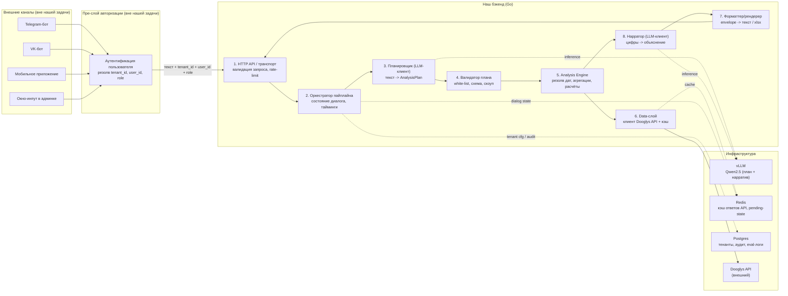
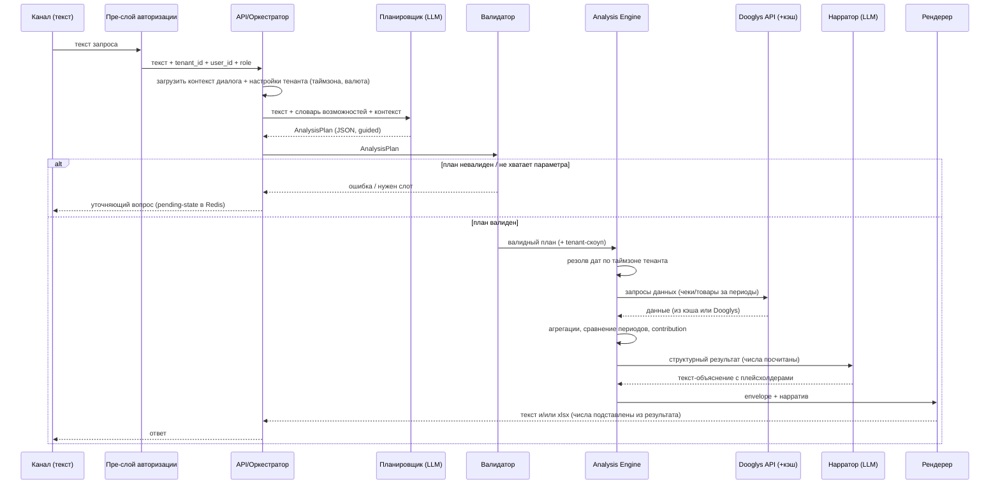
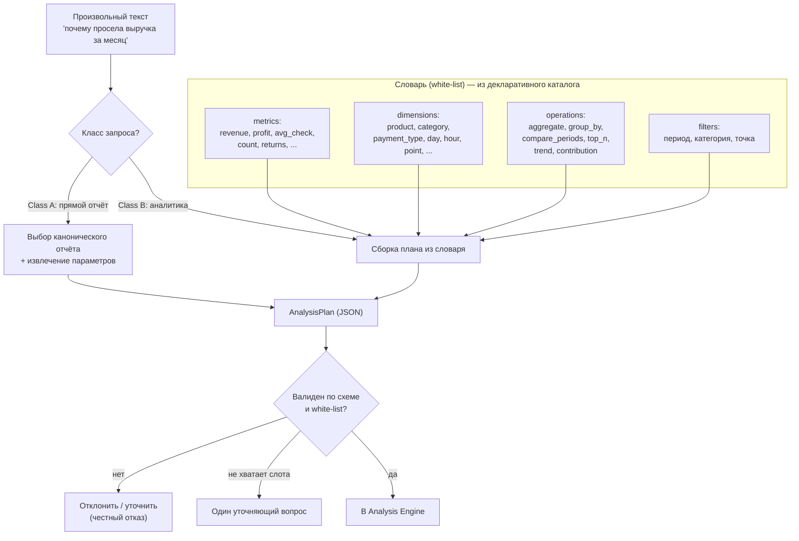
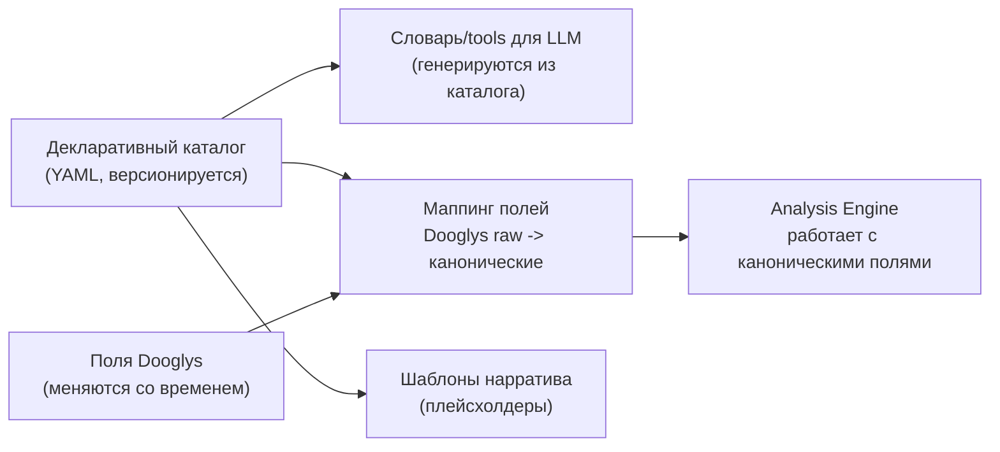

# 01. Архитектура

## 1. Контекст и цель

Бэкенд на Go принимает **готовый текстовый запрос** (источник безразличен: Telegram, VK,
мобильное приложение, окно-инпут в админке) и возвращает аналитику по данным конкретного
заведения на платформе Dooglys. Идентификатор заведения — `tenant_id` (= id организации в
Dooglys) — приходит **не из текста и не от модели**, а из внешнего слоя авторизации.

Три опоры всей системы:

1. **LLM не считает числа** — она планирует *что* посчитать и *объясняет* результат. Считает Go.
2. **Sandwich-безопасность** — LLM зажата между детерминированными валидируемыми слоями.
3. **Конструктор из white-list** — гибкость достигается комбинаторикой разрешённого словаря, а не свободой модели.

---

## 2. Диаграмма компонентов и слоёв

Внешние компоненты слева — не наша зона ответственности на этом этапе (но мы фиксируем
контракт с ними). Наш бэкенд — в центре. Инфраструктура — справа.



### Ответственность слоёв

| # | Слой | Ответственность | Ключевое для безопасности/качества |
|---|---|---|---|
| 1 | HTTP API / транспорт | Приём запроса, валидация payload, rate-limit, корреляция (request_id) | Никогда не доверяет `tenant_id` из тела сверх того, что подтвердил пре-слой |
| 2 | Оркестратор | Дирижирует пайплайном, держит состояние диалога, таймауты/отмена | Worker-pool перед LLM, «печатает…» |
| 3 | Планировщик (LLM) | Текст → `AnalysisPlan` (JSON) через guided decoding | Выдаёт только структуру из словаря, не URL/SQL |
| 4 | Валидатор плана | Проверка плана по JSON-схеме и white-list, проставление tenant-скоупа | Отклоняет всё вне словаря; инъектит `tenant_id` |
| 5 | Analysis Engine | Резолв относительных дат по таймзоне тенанта, агрегации, сравнение периодов, contribution | Вся арифметика здесь, детерминированно |
| 6 | Data-слой | Клиент Dooglys API (токен+refresh), кэш, ретраи | Скоупит каждый вызов по `tenant_id`; токен из защищённого хранилища |
| 7 | Форматтер/рендерер | `envelope` → текст / xlsx; **числа из плейсхолдеров** | LLM не вписывает числа руками |
| 8 | Нарратор (LLM) | Прозаическое объяснение готового результата | Видит только данные этого тенанта |

---

## 3. Путь запроса (sequence)

Пример: владелец пишет «почему за последний месяц просела выручка?».



**Сколько обращений к LLM:** максимум два на запрос — планирование и нарратив.
Class A (простой отчёт) может обходиться одним (планирование) или нулём (если шаблон ответа фиксирован).

---

## 4. Как «думает» модель: конструктор плана из white-list

Модель не выбирает из готовых отчётов — она **собирает** план из разрешённого словаря.
Это и есть источник гибкости при сохранении контроля.



### Пример `AnalysisPlan`

Запрос «почему за последний месяц просела выручка» → план:

```json
{
  "version": "1",
  "class": "B",
  "intent": "explain_metric_change",
  "metric": "revenue",
  "compare": { "period_a": "last_30_days", "period_b": "prev_30_days" },
  "breakdown_by": ["category", "product"],
  "method": "contribution_analysis",
  "top_n": 10,
  "filters": [],
  "output": { "format": "auto", "want_file": false },
  "confidence": 0.86
}
```

Свойства плана:
- **Периоды — относительные токены** (`last_30_days`, `today`, `yesterday`) или явные даты.
  Резолвит в абсолютные даты **Analysis Engine по таймзоне тенанта**, не модель.
- `tenant_id` в плане **отсутствует** — его проставляет валидатор из контекста, не модель.
- `confidence` — для честного отказа / уточнения при низкой уверенности.
- Любое поле вне схемы/словаря → план отклоняется.

> Полная JSON-схема `AnalysisPlan` и словарь будут зафиксированы отдельным файлом
> (`docs/contracts/analysis-plan.schema.json`) на этапе ТЗ, когда уточним список метрик из endpoints.

---

## 5. Лестница гибкости (tiered flexibility)

| Tier | Что это | Гибкость | Безопасность обеспечивается | Фаза |
|---|---|---|---|---|
| 0 | Канонические отчёты (прямой маппинг на endpoint) | низкая | фиксированным маппингом | 1 |
| 1 | Композируемый план из словаря (конструктор) | высокая (тысячи комбинаций) | **ограничением операций** (white-list) | 1–2 |
| 2 | Генерация кода в песочнице над уже выгруженным tenant-scoped датасетом | максимальная | **изоляцией данных и среды** (no net/fs, лимиты CPU/mem/time) | 3 |

Ключевая идея Tier 2 (на будущее): граница доверия переносится с «что можно вычислять»
на «к каким данным есть доступ и где исполняется код». Архитектура (envelope, data-слой
с tenant-скоупом, абстракция плана) строится так, чтобы Tier 2 встал без переделки.

---

## 6. Единый формат вывода (envelope)

Любой результат приводится к единому конверту, рендереры превращают его в текст/файл.

```jsonc
{
  "type": "revenue_explain",          // тип результата
  "tenant_id": "...",                 // проставлен server-side
  "period": { "from": "2026-05-20", "to": "2026-06-18", "tz": "Europe/Moscow" },
  "summary": {                        // ключевые числа (источник истины для рендера)
    "revenue_now": 2123.61,
    "revenue_prev": 2750.0,
    "delta_abs": -626.39,
    "delta_pct": -22.78,
    "currency": "RUB"
  },
  "table": [                          // табличная часть (для текста и xlsx)
    { "category": "Кофе", "delta_pct": -40.0, "contribution": -510.0 }
  ],
  "narrative": "Выручка снизилась на {delta_pct}% ...", // прозаический текст с плейсхолдерами
  "meta": { "from_cache": false, "plan_version": "1", "latency_ms": 0 },
  "raw": null                         // опционально, для отладки
}
```

**Принцип «LLM не пишет числа»:** в `narrative` стоят плейсхолдеры (`{delta_pct}`),
рендерер подставляет значения из `summary`/`table`. Числовые галлюцинации исключены как класс.

Рендереры: `text` (по умолчанию), `xlsx` (по запросу «выгрузи/файл/excel» или при большой таблице).

---

## 7. Гибкость к изменению данных: декларативный каталог и шаблонизация

Поля в Dooglys могут добавляться/меняться. Чтобы это не требовало переписывания кода,
вводим **декларативный каталог** (YAML/JSON, версионируемый), который описывает:

- **отчёты**: имя, описание (для модели), endpoint, поддерживаемые фильтры;
- **метрики**: канонический id → исходное поле Dooglys + единицы/семантика;
- **измерения**: канонический id → поле/группировка;
- **форматтер/шаблон** ответа.



Эффекты:
- **Новый отчёт** = запись в каталог + (при нужде) форматтер. Код ядра не трогаем.
- **Изменилось поле Dooglys** = правка маппинга, а не движка. Движок знает только канонические поля.
- **Промпт/словарь модели** генерируется из каталога — единый источник правды, нет рассинхрона.
- На будущее — редактирование части каталога/шаблонов без передеплоя (вынести в конфиг/БД).

> Открытый вопрос: какие именно поля считать каноническими — зависит от полного списка endpoints
> и семантики полей (см. [02](02-data-contracts-and-open-questions.md)).

---

## 8. Модель безопасности (сводка)

1. `tenant_id` и токены Dooglys — только server-side из пре-слоя и защищённого хранилища; **никогда от LLM/из текста**.
2. Выход LLM ограничен JSON-схемой плана — никаких URL/SQL/произвольных полей.
3. White-list метрик/измерений/операций/endpoints; всё вне списка отклоняется до выполнения.
4. Data-слой принудительно скоупит каждый вызов по `tenant_id`.
5. Нарратору в контекст попадают данные только этого тенанта.
6. Валидация envelope перед отправкой; **числа рендерятся из результата, не из текста модели**.
7. Аудит-лог каждого запроса (и в будущем — каждой мутации).
8. Запись (фаза 4): структурное изменение → человекочитаемый preview → подтверждение → выполнение; + проверка роли, идемпотентность, аудит.

Промпт-инъекция не пробивает «сэндвич»: у модели нет полномочий — максимум валидный
(tenant-scoped) план либо отклонение валидатором.
