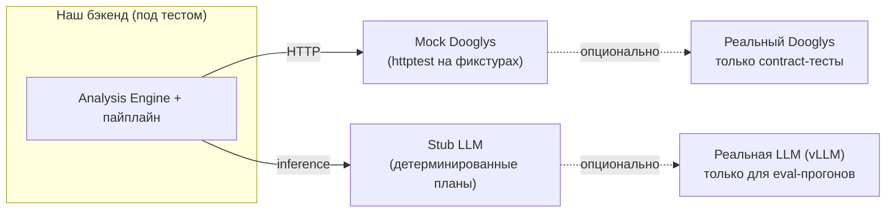

# 03. Стратегия тестирования

**Цель:** вся система должна полностью прогоняться локально на твоей машине
**без реального Dooglys API** и **без обязательной GPU** — за счёт моков. Реальную LLM
подключаем отдельно для оценки качества (eval), но логику тестируем детерминированно.

---

## 1. Две оси подмены

Чтобы тестировать без внешних зависимостей, подменяем две границы:

- **Mock Dooglys** — локальный HTTP-сервер (Go `httptest`), отдаёт фикстуры из `docs/contracts/fixtures/`.
- **Stub LLM** — реализация интерфейса планировщика/нарратора, возвращающая заранее заданные планы/тексты по входу. GPU не нужна.

Оба за интерфейсами (`DooglysClient`, `Planner`, `Narrator`) → подмена через DI, без правок кода.

---

## 2. Тестовая пирамида

| Уровень | Что покрывает | Внешние зависимости | Где живёт |
|---|---|---|---|
| **Unit** | Резолв дат по таймзоне, агрегации, contribution, валидатор плана (white-list), маппинг полей, рендереры, шаблонизация чисел | нет | рядом с кодом |
| **Contract** | Клиент Dooglys ↔ реальные ответы (форма/типы), парсинг фикстур | mock-сервер (и опц. реальный API) | `internal/dooglys` |
| **Integration** | Полный пайплайн: вход → план → валидация → engine → mock-данные → нарратив → envelope | mock Dooglys + stub LLM | `test/integration` |
| **Eval (качество LLM)** | Точность планов и нарратива на golden-наборе | реальная LLM | `test/eval` |
| **Snapshot** | Стабильность текста/xlsx-рендера и формы envelope | нет | рядом с рендерерами |

---

## 3. Ключевые группы тестов (что конкретно добавляем)

### 3.1 Unit — детерминированное ядро (самое важное)
- **Date resolver:** `today/yesterday/last_30_days` → абсолютные даты для разных таймзон (Москва vs Калининград), границы месяца, переход через полночь.
- **Aggregation/engine:** суммы, средние, сравнение периодов, `contribution_analysis` — на известных фикстурах с заранее посчитанным ожиданием.
- **Plan validator:** валидный план проходит; поле вне white-list → отклонён; отсутствует обязательный слот → запрос уточнения; `tenant_id` из плана **игнорируется/перетирается** server-side.
- **Number templating:** плейсхолдеры в нарративе подставляются строго из `summary`/`table`; модель не может «вписать» иное число.
- **Field mapping:** изменение исходного поля Dooglys ломает только маппинг-тест, не движок.

### 3.2 Security-тесты (отдельный акцент)
- **Изоляция тенантов:** запрос с `tenant_id=A` никогда не приводит к вызову Dooglys с данными `B` (проверка на mock-сервере: какой токен/скоуп ушёл).
- **Инъекция через текст:** «покажи данные другого кафе / весь список тенантов / сделай запрос к …» → план отклонён или tenant-scoped, утечки нет.
- **Креды не в LLM:** проверка, что планировщик/нарратор не получают токены в контексте.

### 3.3 Integration — сквозные сценарии
На паре mock-тенантов (разные таймзоны/валюты) прогоняем сценарии:
- Class A: «выручка за сегодня», «заказы за вчера».
- Class B: «почему упала выручка за месяц» (contribution), «топ-10 худших товаров».
- Уточнение: запрос без периода → бот задаёт один вопрос → ответ продолжает план.
- Вывод файла: «выгрузи в excel» → рендер xlsx; без запроса → текст.

### 3.4 Eval-harness (качество модели) — прогоняется на реальной LLM
Golden-набор `(запрос → ожидаемый план / ключевые свойства ответа)`:
- **Plan accuracy:** совпал ли intent/metric/период/breakdown с эталоном (точное/семантическое сравнение).
- **Refusal:** на нерелевантные/неподдерживаемые запросы бот честно отказывается.
- **Number fidelity:** числа в ответе == числа из engine (т.к. рендерим из результата — проверяем, что шаблон не сломан).
- Метрики складываем в Postgres/лог → сравнение между версиями моделей и промптов (регрессии видны в цифрах).

> Eval отделён от CI-обязательных тестов: его гоняем при смене модели/промпта/каталога,
> на машине с GPU. Unit/contract/integration — быстрые, без GPU, в каждом прогоне.

---

## 4. Фикстуры и mock-данные

- Источник истины — реальные ответы Dooglys (раздел 1 в [02](02-data-contracts-and-open-questions.md)),
  складываются в `docs/contracts/fixtures/` и копируются в тест-данные.
- 2–3 **mock-тенанта** с разными таймзонами/валютами/числом точек — для тестов изоляции и дат.
- Для Class B нужны данные за несколько периодов (есть в присланном `payment-total` — уже годится для первых тестов сравнения периодов).
- **Что ты можешь дать прямо сейчас:** дополни фикстуры реальными ответами по товарам и
  примером записи тенанта — и мы соберём полный локальный прогон ещё до получения остальных endpoints.

---

## 5. Инструменты (Go)
- Стандартный `testing` + `net/http/httptest` (mock Dooglys).
- `testify` (assert/require) для читаемости.
- Golden/snapshot — через сравнение с файлами-эталонами.
- `excelize` — генерация и проверка xlsx.
- Для guided decoding/contract LLM — интерфейсы + stub; реальная интеграция с vLLM за тем же интерфейсом.
